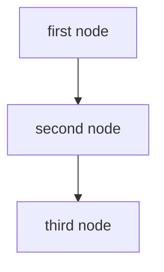

# graph_api.ts

Le but de cet article est de découvrir une mise en place d'une [API][api] [RESTfull][rest] en utilisant [TypeScript][typescript].

> TypeScript est un langage de programmation libre et open source développé par Microsoft qui a pour but (...) de sécuriser la production de code JavaScript. (...) . Le code TypeScript est transcompilé en JavaScript (...) et permet un typage statique optionnel des variables et des fonctions, la création de classes et d'interfaces, l'import de modules, tout en conservant l'approche non-contraignante de JavaScript. [Wikipedia - TypeScript](https://fr.wikipedia.org/wiki/TypeScript)

Nous allons donc mettre en place un système de _graph_api_ très basique. Nous allons créer deux modèles:

- un **node** (nœud) qui représente une étape simple. Elle contient juste un `nom' et un`id'.
- un **link** (lien) qui ne connecte que deux nœuds avec des attributs `from_id' et`to_id'.

C'est aussi simple que ça.

Pour construire l'API, j'utiliserai [Express.js], un framework minimaliste qui nous permet de faire des API en JavaScript. J'utiliserai aussi

A la fin de l'article, l'API pourra générer un définition d'un graphe [Mermaid][mermaid] qui permet ainsi de convertir le graph_api en un beau graphique comme celui ci-dessous:


_Let's go_!

> NOTE: je vais aller un peu vite car c'est un peu un aide-mémoire pour moi-même. Tout le code est disponible sur le [_repository_ Github `graph_api.ts`][github_repo]

> TL;DR: La grand liberté d'Express nous permet de décider nous même de l'architecture de notre application et TypeScript nous donne la possibilité de créer de vrais _design paterns_.

## Setup project

Commençons donc par créer un nouveau projet avec [NPM](https://www.npmjs.com/) et [Git](https://git-scm.com/).

```bash
$ mkdir graph_api.ts
$ cd graph_api.ts/
$ npm init
$ git init
```

Ensuite nous allons installer quelques dépendances avec NPM pour construire le serveur HTTP:

```bash
$ npm install --save express body-parser
$ npm install --save-dev typescript ts-node @types/express @types/node
```

Comme nous utilisons [TypeScript][typescript], nous avons besoin de créer un fichier `tsconfig.json` pour indiquer à TypeScript que les fichiers seront transpilés depuis `lib` vers le dossier `dist`. Nous précision aussi que nous utiliserons la syntaxe [ES6][es6]:

```json
// tsconfig.json
{
  "compilerOptions": {
    "module": "commonjs",
    "moduleResolution": "node",
    "pretty": true,
    "sourceMap": true,
    "target": "es6",
    "outDir": "./dist",
    "baseUrl": "./lib"
  },
  "include": ["lib/**/*.ts"],
  "exclude": ["node_modules"]
}
```

Maintenant nous allons créer le `lib/app.ts`. Ce dernier se chargera de la configuration, du chargement des routes et du démarrage du serveur Express:

```typescript
// lib/app.ts
import * as express from "express";
import * as bodyParser from "body-parser";
import { Routes } from "./config/routes";

class App {
  public app: express.Application;
  public routePrv: Routes = new Routes();

  constructor() {
    this.app = express();
    this.config();
    this.routePrv.routes(this.app);
  }

  private config(): void {
    this.app.use(bodyParser.json());
    this.app.use(bodyParser.urlencoded({ extended: false }));
  }
}

export default new App().app;
```

Comme vous pouvez le remarquer, nous chargeons les routes pour définir les contrôleurs et les routes pour respecter le modèle MVC. Voici le premier `NodesController` qui se chargera des actions relatives aux _nodes_ avec une action `index:`

```typescript
// lib/controllers/nodes.controller.ts
import { Request, Response } from "express";

export class NodesController {
  public index(req: Request, res: Response) {
    res.json({
      message: "Hello boi"
    });
  }
}
```

Nous allons maintenant séparer les routes dans un fichier à part:

```typescript
// lib/config/routes.ts
import { Request, Response } from "express";
import { NodesController } from "../controllers/nodes.controller";

export class Routes {
  public nodesController: NodesController = new NodesController();

  public routes(app): void {
    app.route("/").get(this.nodesController.index);

    app.route("/nodes").get(this.nodesController.index);
  }
}
```

Maintenant nous pouvons charger l'application et la démarrer dans un fichier `server.ts`:

Et un fichier `lib/server.ts` pour lancer l'objet `App`:

```ts
// lib/server.ts
import app from "./app";
const PORT = process.env.PORT || 3000;

app.listen(PORT, () => console.log(`Example app listening on port ${PORT}!`));
```

Et c'est tout. Vous pouvez démarrer le serveur en utilisant `npm run dev` et essayer l'API en utilisant cURL:

```bash
$ curl http://localhost:3000/nodes
{"message":"Hello boi"}
```

Jusqu'ici tout fonctionne.

## Setup sequelize

[Sequelize][sequelize] est un[ORM (Object Relational Mapping)][orm] qui est chargé de traduire l'objet TypeScript dans les requêtes SQL pour enregistrer les modèles. La documentation de TypeScript (http://docs.sequelizejs.com/manual/typescript) est vraiment complète mais ne paniquez pas, je vais vous montrer comment l'implémenter avec Express.

Nous commençons à ajouter des bibliothèques:

```bash
$ npm install --save sequelize sqlite
$ npm install --save-dev @types/bluebird @types/validator @types/sequelize
```

> Vous remarquerez peut-être que j'ai choisi la base de données SQLite pour sa simplicité mais vous pouvez utiliser MySQL ou Postgres.

Ensuite, nous allons créer un fichier _lib/config/database.ts_ pour configurer Sequelize database system. Pour plus de simplicité, je crée une base de données Sqlite en mémoire :

```ts
// lib/config/database.ts
import { Sequelize } from "sequelize";

export const database = new Sequelize({
  database: "some_db",
  dialect: "sqlite",
  storage: ":memory:"
});
```

Ensuite, nous pourrons créer un **modèle**. Nous commencerons par le modèle **Node** qui étend la classe Sequelize `Model` :

```ts
// lib/models/node.model.ts
import { Sequelize, Model, DataTypes, BuildOptions } from "sequelize";
import { database } from "../config/database";

export class Node extends Model {
  public id!: number;
  public name!: string;
  public readonly createdAt!: Date;
  public readonly updatedAt!: Date;
}
// ...
```

Vous pouvez remarquer que j'ai rajouté deux champs `createdAt` et `updatedAt` que [Sequelize][sequelize] remplira automatiquement.

Ensuite, nous configurons le schéma SQL de la table et appelons `Node.sync`. Ceci créera une table dans la base de données Sqlite.

```ts
// lib/models/node.model.ts
// ...
Node.init(
  {
    id: {
      type: DataTypes.INTEGER.UNSIGNED,
      autoIncrement: true,
      primaryKey: true
    },
    name: {
      type: new DataTypes.STRING(128),
      allowNull: false
    }
  },
  {
    tableName: "nodes",
    sequelize: database // this bit is important
  }
);

Node.sync({ force: true }).then(() => console.log("Node table created"));
```

C'est tout! Lorsque vous démarrez le serveur `npm run dev` vous verrez que la table est automatiquement crée.

## Mettre en place le controller Node

Maintenant que nous avons configuré la base de données, créons des méthodes CRUD simples dans le contrôleur. Cela signifie :

- `index` pour afficher la liste des nœuds
- `show` pour afficher un nœud
- `create` pour ajouter un nouveau nœud
- `update` pour éditer un nœud
- `delete` pour supprimer un nœud

### Index

```ts
// lib/controllers/nodes.controller.ts
import { Request, Response } from "express";
import { Node } from "../models/node.model";

export class NodesController {
  public index(req: Request, res: Response) {
    Node.findAll<Node>({})
      .then((nodes: Array<Node>) => res.json(nodes))
      .catch((err: Error) => res.status(500).json(err));
  }
}
```

Comme précédemment, nous devons ajouter la route:

```ts
// lib/config/routes.ts
import { Request, Response } from "express";
import { NodesController } from "../controllers/nodes.controller";

export class Routes {
  public nodesController: NodesController = new NodesController();

  public routes(app): void {
    // ...
    app.route("/nodes").get(this.nodesController.index);
  }
}
```

Et pour tester cela, nous pouvons utiliser cURL:

```bash
$ curl http://localhost:3000/nodes/
[]
```

Cela semble fonctionner mais nous n'avons pas encore de données dans la base de données SQlite. Continuons afin de les ajouter.

### Create

Nous allons d'abord définir une **interface** qui définit les propriétés que nous devrions recevoir de la requête POST. Nous voulons seulement recevoir la propriété `name` comme `String`. Nous utiliserons cette interface pour définir les propriétés de l'objet `req.body`. Ceci empêchera l'utilisateur d'injecter un paramètre que nous ne voulons pas enregistrer dans la base de données. C'est une bonne pratique.

```ts
// lib/models/node.model.ts
// ...
export interface NodeInterface {
  name: string;
}
```

Maintenant, revenons au contrôleur. Nous appelons simplement la méthode `Node.create` et passons en paramètres `req.body`. Ensuite, nous utiliserons un **Promesse** pour traiter certaines erreurs:

```ts
// lib/controllers/nodes.controller.ts
// ...
import { Node, NodeInterface } from "../models/node.model";

export class NodesController {
  // ...
  public create(req: Request, res: Response) {
    const params: NodeInterface = req.body;

    Node.create<Node>(params)
      .then((node: Node) => res.status(201).json(node))
      .catch((err: Error) => res.status(500).json(err));
  }
}
```

Et n'oublions pas de mettre en place la route:

```ts
// lib/config/routes.ts
// ...
export class Routes {
  // ...
  public routes(app): void {
    // ...
    app
      .route("/nodes")
      .get(this.nodesController.index)
      .post(this.nodesController.create);
  }
}
```

Et voilà. Nous pouvons essayer de tester le fonctionnement avec cURL:

```bash
$ curl -X POST --data "name=first" http://localhost:3000/nodes/
{"id":2,"name":"first","updatedAt":"2019-06-14T11:12:17.606Z","createdAt":"2019-06-14T11:12:17.606Z"}
```

Cela semble fonctionner. Testons avec une mauvaise requête.

```bash
$ curl -X POST http://localhost:3000/nodes/
{"name":"SequelizeValidationError","errors":[{"message":"Node.name cannot be null","type":"notNull Violation",...]}
```

Parfait! Allons plus loins.

### Show

La méthode `show` a une petite différence: nous avons besoin d'un `id' comme paramètre GET. Cela signifie que nous devrions avoir une URL comme celle-ci :`/nodes/1`. C'est simple à faire lorsque vous construisez la route.

Voilà l'implémentation.

```ts
// lib/config/routes.ts
// ...
export class Routes {
  // ...
  public routes(app): void {
    // ...
    app.route("/nodes/:id").get(this.nodesController.show);
  }
}
```

Maintenant nous pouvons obtenir le paramètre `id` en utilisant `req.params.id`. Ensuite, nous utilisons simplement la méthode `Node.findByPk` et manipulons quand cette Promesse obtient une valeur `null` qui signifie que le _node_ n'a pas été trouvé. Dans ce cas, nous renvoyons une réponse de type 404:

```ts
// lib/controllers/nodes.controller.ts
// ...
export class NodesController {
  // ...
  public show(req: Request, res: Response) {
    const nodeId: number = req.params.id;

    Node.findByPk<Node>(nodeId)
      .then((node: Node | null) => {
        if (node) {
          res.json(node);
        } else {
          res.status(404).json({ errors: ["Node not found"] });
        }
      })
      .catch((err: Error) => res.status(500).json(err));
  }
}
```

Maintenant, ça devrait aller. Essayons:

```bash
$ curl -X POST http://localhost:3000/nodes/1
{"id":1,"name":"first","createdAt":"2019-06-14T11:32:47.731Z","updatedAt":"2019-06-14T11:32:47.731Z"}
$ curl -X POST http://localhost:3000/nodes/99
{"errors":["Node not found"]}
```

### Update

Update method seams like the previous one and need an `id` parameter. Let's build route:

La méthode `update` fonctionne comme la précédente et nécessite un paramètre `id`. Construisons la route:

```ts
// lib/config/routes.ts
// ...
export class Routes {
  // ...
  public routes(app): void {
    // ...
    app
      .route("/nodes/:id")
      .get(this.nodesController.show)
      .put(this.nodesController.update);
  }
}
```

Maintenant nous allons utiliser la méthode `Node.update` qui prend deux paramètres:

- une interface `NodeInterface` qui contient les propriétés à mettre à jour
- une interface `UpdateOptions` qui contient la contrainte SQL `WHERE`.

Puis `Node.update` retourne une _Promesse_ comme beaucoup de méthodes Sequelize.

```ts
// lib/controllers/nodes.controller.ts
import { UpdateOptions } from "sequelize";
// ...
export class NodesController {
  // ...
  public update(req: Request, res: Response) {
    const nodeId: number = req.params.id;
    const params: NodeInterface = req.body;

    const update: UpdateOptions = {
      where: { id: nodeId },
      limit: 1
    };

    Node.update(params, update)
      .then(() => res.status(202).json({ data: "success" }))
      .catch((err: Error) => res.status(500).json(err));
  }
}
```

Compris? On va essayer:

```bash
$ curl -X PUT --data "name=updated" http://localhost:3000/nodes/1
{"data":"success"}}
```

Parfait! Continuons.

### Destroy

Destroy method seams like the previous one and need an `id` parameter. Let's build route:

```ts
// lib/config/routes.ts
// ...
export class Routes {
  // ...
  public routes(app): void {
    // ...
    app
      .route("/nodes/:id")
      .get(this.nodesController.show)
      .put(this.nodesController.update)
      .delete(this.nodesController.delete);
  }
}
```

Pour la méthode `destroy` nous allons appeler la méthode `Node.destroy` qui prend en paramètre une interface de type `DestroyOptions`.

```ts
// lib/controllers/nodes.controller.ts
// ...
import { UpdateOptions, DestroyOptions } from "sequelize";

export class NodesController {
  // ...
  public delete(req: Request, res: Response) {
    const nodeId: number = req.params.id;
    const options: DestroyOptions = {
      where: { id: nodeId },
      limit: 1
    };

    Node.destroy(options)
      .then(() => res.status(204).json({ data: "success" }))
      .catch((err: Error) => res.status(500).json(err));
  }
}
```

Essayons:

```bash
$ curl -X DELETE  http://localhost:3000/nodes/1
```

Perfect!

## Create the Link relationship

Maintenant, nous voulons créer le deuxième modèle : le `link`. Il possède deux attributs:

- `from_id` qui sera une liaison sur le nœud précédent
- `to_id` qui sera une liaison sur le nœud suivant

### Mise en place des actions CRUD

Je vais être plus rapide sur la mise en œuvre des actions CRUD de base puisque c'est la même logique que les nœuds:

Le modèle:

```ts
// lib/models/node.model.ts
import { Model, DataTypes } from "sequelize";
import { database } from "../config/database";
import { Node } from "./node.model";

export class Link extends Model {
  public id!: number;
  public fromId!: number;
  public toId!: number;
  // timestamps!
  public readonly createdAt!: Date;
  public readonly updatedAt!: Date;
}

export interface LinkInterface {
  name: string;
  fromId: number;
  toId: number;
}

Link.init(
  {
    id: {
      type: DataTypes.INTEGER.UNSIGNED,
      autoIncrement: true,
      primaryKey: true
    },
    fromId: {
      type: DataTypes.INTEGER.UNSIGNED,
      allowNull: false
    },
    toId: {
      type: DataTypes.INTEGER.UNSIGNED,
      allowNull: false
    }
  },
  {
    tableName: "links",
    sequelize: database
  }
);

Link.sync({ force: true }).then(() => console.log("Link table created"));
```

Le contrôleur:

```ts
// lib/controllers/links.controller.ts
import { Request, Response } from "express";
import { Link, LinkInterface } from "../models/link.model";
import { UpdateOptions, DestroyOptions } from "sequelize";

export class LinksController {
  public index(_req: Request, res: Response) {
    Link.findAll<Link>({})
      .then((links: Array<Link>) => res.json(links))
      .catch((err: Error) => res.status(500).json(err));
  }

  public create(req: Request, res: Response) {
    const params: LinkInterface = req.body;

    Link.create<Link>(params)
      .then((link: Link) => res.status(201).json(link))
      .catch((err: Error) => res.status(500).json(err));
  }

  public show(req: Request, res: Response) {
    const linkId: number = req.params.id;

    Link.findByPk<Link>(linkId)
      .then((link: Link | null) => {
        if (link) {
          res.json(link);
        } else {
          res.status(404).json({ errors: ["Link not found"] });
        }
      })
      .catch((err: Error) => res.status(500).json(err));
  }

  public update(req: Request, res: Response) {
    const linkId: number = req.params.id;
    const params: LinkInterface = req.body;

    const options: UpdateOptions = {
      where: { id: linkId },
      limit: 1
    };

    Link.update(params, options)
      .then(() => res.status(202).json({ data: "success" }))
      .catch((err: Error) => res.status(500).json(err));
  }

  public delete(req: Request, res: Response) {
    const linkId: number = req.params.id;
    const options: DestroyOptions = {
      where: { id: linkId },
      limit: 1
    };

    Link.destroy(options)
      .then(() => res.status(204).json({ data: "success" }))
      .catch((err: Error) => res.status(500).json(err));
  }
}
```

Les routes:

```ts
// lib/config/routes.ts
import { Request, Response } from "express";
import { NodesController } from "../controllers/nodes.controller";
import { LinksController } from "../controllers/links.controller";

export class Routes {
  public nodesController: NodesController = new NodesController();
  public linksController: LinksController = new LinksController();

  public routes(app): void {
    // ...
    app
      .route("/links")
      .get(this.linksController.index)
      .post(this.linksController.create);

    app
      .route("/links/:id")
      .get(this.linksController.show)
      .put(this.linksController.update)
      .delete(this.linksController.delete);
  }
}
```

Maintenant tout devrait fonctionner comme les routes des _nodes_.

```bash
$ curl -X POST --data "fromId=420" --data "toId=666"  http://localhost:3000/links
$ curl http://localhost:3000/links
[{"id":1,"fromId":420,"toId":666,"createdAt":"2019-06-18T11:09:49.739Z","updatedAt":"2019-06-18T11:09:49.739Z"}]
```

Cela à l'air de fonctionner mais vous voyez ce qui ne va pas? Nous venons de construire un lien vers deux nœuds qui n'existent pas! Corrigeons cela:

### Relationships

Avec sequelize nous pouvons facilement construire des relations entre les modèles en utilisant `belongTo` & `hasMany`. C'est ce qu'on va faire:

```ts
// lib/models/node.model.ts
import { Link } from "./link.model";
// ...

Node.hasMany(Link, {
  sourceKey: "id",
  foreignKey: "fromId",
  as: "previousLinks"
});

Node.hasMany(Link, {
  sourceKey: "id",
  foreignKey: "toId",
  as: "nextLinks"
});

Node.sync({ force: true }).then(() => console.log("Node table created"));
```

Maintenant relancez le serveur en utilisant `npm run dev`. Vous devriez voir passer la requête SQL query qui vient de créer la table:

```sql
Executing (default): CREATE TABLE IF NOT EXISTS `links` (`id` INTEGER PRIMARY KEY AUTOINCREMENT, `fromId` INTEGER NOT NULL REFERENCES `nodes` (`id`) ON DELETE CASCADE ON UPDATE CASCADE, `toId` INTEGER NOT NULL REFERENCES `nodes` (`id`) ON DELETE CASCADE ON UPDATE CASCADE, `createdAt` DATETIME NOT NULL, `updatedAt` DATETIME NOT NULL);
```

Vous voyez la différence? Sequelize créé une **clé étrangère** entre la table des _links_ et des _nodes_ qui nous empêchera de créer des relations cassées.

```bash
$ curl -X POST --data "fromId=420" --data "toId=666"  http://localhost:3000/links
{"name":"SequelizeForeignKeyConstraintError"
```

Parfait. Essayons avec des _links_ valides:

```bash
$ curl -X POST --data "name=first"  http://localhost:3000/nodes
{"id":1,"name":"first","updatedAt":"2019-06-18T11:21:38.264Z","createdAt":"2019-06-18T11:21:38.264Z"}
$ curl -X POST --data "name=second"  http://localhost:3000/nodes
{"id":2,"name":"second","updatedAt":"2019-06-18T11:21:47.327Z","createdAt":"2019-06-18T11:21:47.327Z"}
$ curl -X POST --data "fromId=1" --data "toId=2"  http://localhost:3000/links
{"id":1,"fromId":"1","toId":"2","updatedAt":"2019-06-18T11:22:10.439Z","createdAt":"2019-06-18T11:22:10.439Z"}
```

Parfait!

Sequelize permet de faire bien plus de choses et je n'éffleure que le sujet. Je vous invite à jeter un coup d'œil à [leur documentation](http://docs.sequelizejs.com/manual/associations.html).

## Dessiner le graphique

Nous allons maintenant utiliser notre modèle pour dessiner un graphique. Pour ce faire, nous utiliserons [Mermaid.js][mermaid] qui génère un beau graphique à partir des définitions de texte du plan. Une définition valide ressemble à ceci:



C'est très simple. Créez une nouvel route liée à un nouveau contrôleur.

```ts
// lib/config/routes.ts
// ...
import { GraphController } from "../controllers/graph.controller";

export class Routes {
  public nodesController: NodesController = new NodesController();
  public linksController: LinksController = new LinksController();
  public graphController: GraphController = new GraphController();

  public routes(app): void {
    app.route("/").get(this.graphController.mermaid);
    // ...
  }
}
```

Puis utilisons Sequelize pour obtenir tous les nœuds et tous les liens pour dessiner le graphique.

Je déplace tout le code dans une **Promesse** pour améliorer la lisibilité et la gestion des erreurs. C'est une implémentation simple donc vous pourriez vouloir l'améliorer (et vous auriez raison) mais c'est suffisant dans mon cas.

```ts
// lib/controllers/build.controller.ts
import { Request, Response } from "express";
import { Link } from "../models/link.model";
import { Node } from "../models/node.model";

export class GraphController {
  public mermaid(_req: Request, res: Response) {
    // we'll englobe all logic into a big promise
    const getMermaid = new Promise<string>((resolve, reject) => {
      let graphDefinition = "graph TD;\r\n";

      Node.findAll({})
        // get all nodes and build mermaid definitions like this `1[The first node]`
        .then((nodes: Array<Node>) => {
          nodes.forEach((node: Node) => {
            graphDefinition += `${node.id}[${node.name}];\r\n`;
          });
        })
        // get all links
        .then(() => Link.findAll())
        // build all link in mermaid
        .then((links: Array<Link>) => {
          links.forEach((link: Link) => {
            graphDefinition += `${link.fromId} --> ${link.toId};\r\n`;
          });

          resolve(graphDefinition);
        })
        .catch((err: Error) => reject(err));
    });

    // call promise and return plain text
    getMermaid
      .then((graph: string) => res.send(graph))
      .catch((err: Error) => res.status(500).json(err));
  }
}
```

Une fois terminé, nous allons redémarrer le serveur et créer quelques entités en utilisant cURL:

```bash
$ curl -X POST --data "name=first"  http://localhost:3000/nodes
$ curl -X POST --data "name=second"  http://localhost:3000/nodes
$ curl -X POST --data "name=third"  http://localhost:3000/nodes
$ curl -X POST --data "fromId=1" --data "toId=2"  http://localhost:3000/links
$ curl -X POST --data "fromId=2" --data "toId=3"  http://localhost:3000/links
```

Testons maintenant le résultat:

```bash
$ curl http://localhost:3000
graph TD;
1[first];
2[second];
3[third];
1 --> 2;
2 --> 3;
```

Parfait!

## Aller plus loin

Nous arrivons donc au terme de cet article.

Nous avons construit les fondations d'une API pour dessiner des graphiques mais rien ne vous empêche d'aller plus loins. Voici quelques pistes:

- ajouter des test fonctionnels pour tester les contrôleur
- ajouter un attribut `name` optionnel que serait inséré dans le schéma
- lier les `nodes` à un un objet `graph`
- ajouter un système d'authentification avec JWT

Comme vous pouvez le voir, ExpressJS est une boîte à outil qui s'interface très bien avec TypeScript. La grand liberté d'Express nous permet de décider nous même de l'architecture de notre application et TypeScript nous donne la possibilité de créer de vrais _design paterns_.

## Liens

- https://glebbahmutov.com/blog/how-to-correctly-unit-test-express-server/
- https://www.techighness.com/post/unit-testing-expressjs-controller-part-1/
- https://blog.logrocket.com/a-quick-and-complete-guide-to-mocha-testing-d0e0ea09f09d/

[mermaid]: https://github.com/knsv/mermaid
[typescript]: https://www.typescriptlang.org/
[es6]: https://en.wikipedia.org/wiki/ECMAScript#6th_Edition_-_ECMAScript_2015
[orm]: https://en.wikipedia.org/wiki/Object-relational_mapping
[rest]: https://en.wikipedia.org/wiki/Representational_state_transfer
[api]: https://en.wikipedia.org/wiki/Application_programming_interface
[express]: https://expressjs.com/
[sequelize]: http://docs.sequelizejs.com
[mocha]: https://mochajs.org/
[github_repo]: https://github.com/madeindjs/graph_api.ts
